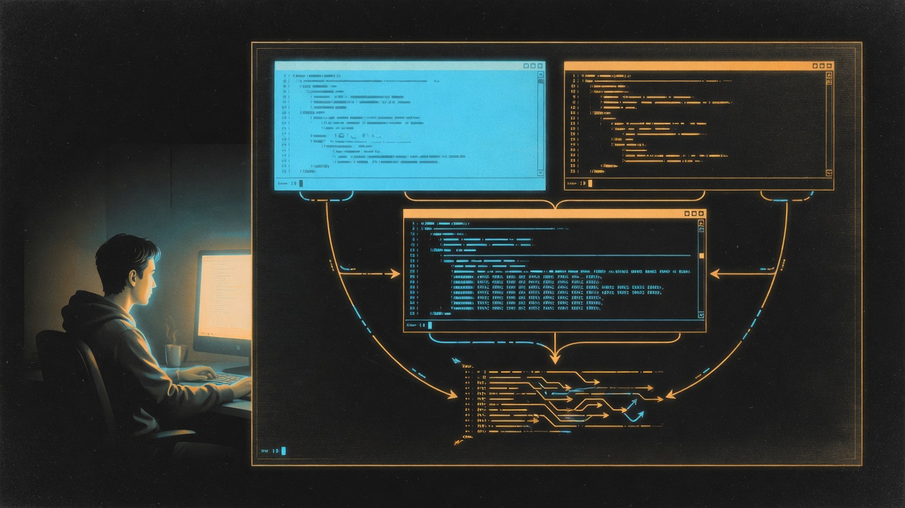
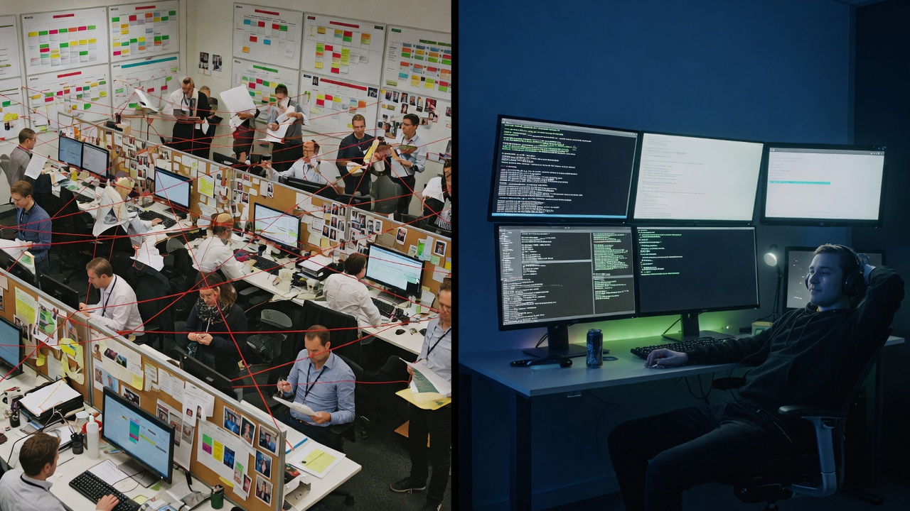

# pi-yahe

## Less structure. More intelligence.

*A minimal bridge between Pi and Herdr for visible, task-driven multi-agent work.*

<p align="center">
  
</p>
<p align="center"><sub>One parent. Temporary terminals. Results flow home.</sub></p>

YAHE stands for *Yet Another Herdr Extension* — the name is the thesis. The ecosystem already has good Herdr integrations; the last thing it needs is another framework. So this one tries to be the opposite: one tool, no structure to configure, and a quiet apology for existing at all.

The motto is borrowed. [Manus](https://manus.im) argues that agents need **less structure, more intelligence** — fewer rails, more judgment. This project is a terminal-native attempt to take that seriously.

This is also the practical experiment behind my note [“Agents Need Shells, Not Selves”](https://marv1nnnnn.github.io/signals/journal/agents-need-shells-not-selves). Most multi-agent systems start by turning model invocations into employees: names, roles, inboxes, managers. I wanted to try the opposite — keep the abstraction at the level of a shell command, and let the agent decide at runtime whether another process is worth starting at all. pi-yahe is the smallest surface that makes that possible inside Pi and Herdr.

> Experimental. Requires Pi 0.83+ and Herdr 0.7.5+.

## What it is

[Pi](https://pi.dev) is an extensible terminal coding agent. [Herdr](https://herdr.dev) is a persistent terminal workspace that owns the panes, processes, and project workspaces. Together they have everything needed for multi-agent work except one primitive: a way for the current Pi to assemble terminals into temporary workers and get their results back without waiting or polling.

`pi-yahe` supplies that primitive as **one composable `herdr` tool**. The current Pi can launch a background command, create a fresh Pi with task-specific models and permissions, isolate a concurrent writer in a worktree, keep an interactive worker for follow-up, and receive asynchronous results automatically. No profiles, no workflow configuration, no daemon, no database, no queue — one extension, one tool, zero runtime npm dependencies.

<p align="center">
  <a href="https://github.com/herdrdev/herdr">
    
  </a>
</p>
<p align="center"><sub>The actual habitat: real agents in real Herdr panes. Screenshot from the Herdr project.</sub></p>

```text
You ask Pi for an outcome
          │
          ▼
current Pi ──► tests in a visible tab ───────┐
     │                                       │
     ├──────► read-only investigator ────────┼──► results steer back automatically
     │                                       │
     └──────► isolated worktree + worker ────┘
```

## Install

Start Pi inside a Herdr pane, then:

```bash
pi install npm:pi-yahe
```

Or try a checkout directly:

```bash
git clone https://github.com/marv1nnnnn/pi-yahe.git
cd pi-yahe
npm install
pi -e ./src/index.ts
```

For accurate Pi lifecycle state in the Herdr sidebar:

```bash
herdr integration install pi
```

## Just ask Pi

You normally do not call YAHE actions yourself or describe an organization. State the outcome and let Pi decide whether another process would help:

```text
Investigate this race condition. Use independent workers if they would reduce uncertainty,
but do not create them unless they help.
```

```text
Run the test suite visibly while you inspect the failing implementation. Keep working;
do not wait on the test process.
```

Workers can be shaped per task with `piArgs` — Pi’s native flags, not a new profile format:

```json
{
  "action": "run_pi",
  "label": "auth boundary scan",
  "prompt": "Trace authentication trust boundaries. Cite files and lines. Do not edit files.",
  "piArgs": ["--model", "sonnet:high", "--tools", "read,grep,find,ls"]
}
```

The topology stays open: one task may need three workers, the next may need none. The tool surface is small — commands, fresh workers, interactive workers, terminal control, and isolation ([full action list](DEVELOPMENT.md#tool-actions)).

## Who this is for

**Use YAHE when** you trust the agent’s judgment about when parallelism helps, you want the work visible and interruptible in real terminals, and you want zero configuration in exchange. Your workers are processes: watch them, grab them mid-flight, kill them with your hands.

**Do not use YAHE when** you need enforced review policies, durable queues, resumable one-shot sessions, strict sandboxing, or a heterogeneous fleet API — the [comparison section](#design-trade-offs) points at packages built for those. Or when you need to see the full reasoning trace of a worker afterwards: run_pi workers are intentionally ephemeral, though their output survives in a run log ([Development](DEVELOPMENT.md)).

## Design trade-offs



<p align="center"><sub>Left: invent a company. Right: start a process.</sub></p>

### Against tmux

If the abstraction is the process, why not tmux? Because tmux gives you **persistent terminals**, and this needs **terminals that know what is running inside them**.

| Need | tmux | Herdr |
|---|---|---|
| Keep terminals alive after detach | ✅ | ✅ |
| Split, resize, scrollback | ✅ | ✅ |
| Know which agent runs in a pane | ❌ | ✅ |
| Ask a pane's agent something and wait | ❌ | ✅ |
| Route work to the right project workspace | ❌ | ✅ |
| Isolate concurrent writers natively | ❌ | ✅ |
| Create a tab running a command, observe its completion, collect output | ❌ | ✅ |

The last three rows are the point: YAHE's loop is spawn → run → collect → close, and only Herdr exposes that loop as an API. But the trade is real. tmux is universal, dependency-free, and stable for decades; Herdr is a moving target, its CLI is the de-facto contract here, and this project tracks it explicitly (Herdr 0.7.5+). If you only need a long-lived personal terminal environment, use tmux — it is the better tool for that job, and nothing here competes with it.

### Against other Herdr integrations

YAHE explores one narrow trade-off: **less prescribed orchestration, more runtime agency**, with automatic asynchronous return. Other integrations make different, useful choices.

| If you want… | Prefer… |
|---|---|
| Complete, typed Herdr primitives | [`@ogulcancelik/pi-herdr`](https://github.com/ogulcancelik/pi-extensions/tree/main/packages/pi-herdr) |
| Claude/Codex/OpenCode fleet orchestration | [`@andrewjacop/pi-herdr`](https://github.com/AndrewJacop/pi-herdr) |
| Resumable subagent sessions and crash sidecars | [`pi-herdr-subagents`](https://github.com/0xRichardH/pi-herdr-subagents) |
| Enforced read-only investigation squads | [`pi-herdr-squad`](https://github.com/jillesme/pi-herdr-squad) |
| Conversation fork and merge | [`pi-herdr-btw`](https://github.com/oscabriel/pi-herdr-btw) |
| Workers as plain processes — no agent entities | **YAHE** |

To be honest about the overlap: [`pi-herdr-subagents`](https://github.com/0xRichardH/pi-herdr-subagents) already delivers non-blocking workers whose results steer back automatically, with a live status widget on top. If you want a function API (`subagent()`), named agent templates, and tracked state machines, that package is the more mature choice — this table should not pretend otherwise. The wider ecosystem agrees: “subagent” is the default answer in this space, to the point that Herdr's own author is building a codex-style subagent extension of his own.

YAHE is the only bet in the other direction: **the worker stays a process**. No subagent entity, no templates, no state machine, no widget — the whole abstraction is a pane and a command. That is the “shells, not selves” claim made concrete:

- **No new concepts.** There is no `subagent()` function to learn, no agent templates, no role files. The entire surface is one tool with a handful of actions.
- **Workers can nest.** A temporary worker may spawn its own workers, and its parent stays alive until the nested work returns — the process tree goes as deep as the task needs.
- **Every worker is a real terminal.** Not a managed agent record: a pane you can focus, interrupt, type into, or take over, that closes itself when done.
- **Zero configuration.** No squad definitions, no queue daemon, no profiles — just Pi, Herdr, and Node built-ins.

If your workflow needs named, tracked subagents, durable sessions, or enforced policy, the structured packages are the honest answer. If you want the agent to assemble its own process tree and the worker to remain a process you can grab, YAHE is the bet that stays true to that.

## Safety

Pi packages execute with the user's full permissions. Review the source before installing. YAHE does not sandbox workers — use `piArgs` to narrow tools and worktrees to isolate concurrent writers. Completion signals live in a mode-0700 directory owned by the invoking user; see [Development](DEVELOPMENT.md) for the details.

## Development

Architecture, the sidecar delivery protocol, and contribution notes live in [DEVELOPMENT.md](DEVELOPMENT.md).

```bash
npm install
npm run check
npm run pack:check
```

The package ships TypeScript directly; Pi loads it through its extension runtime.

## License

MIT
